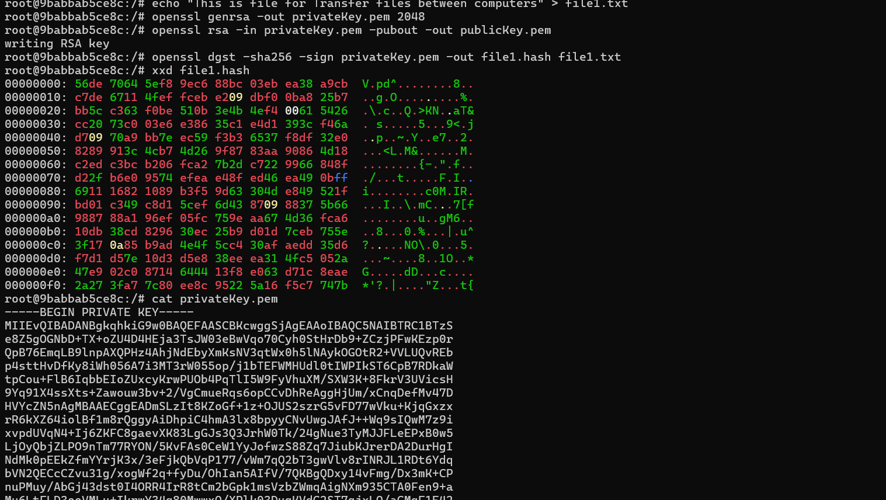
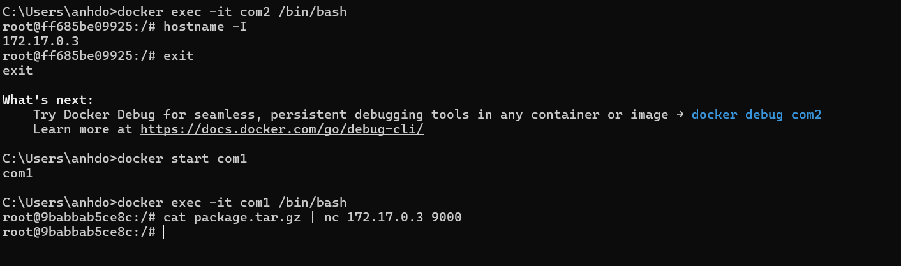
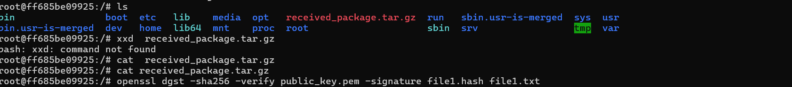
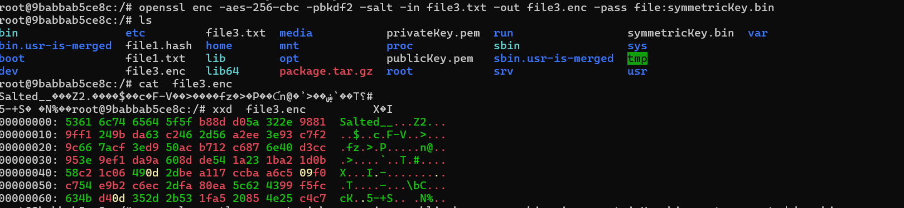
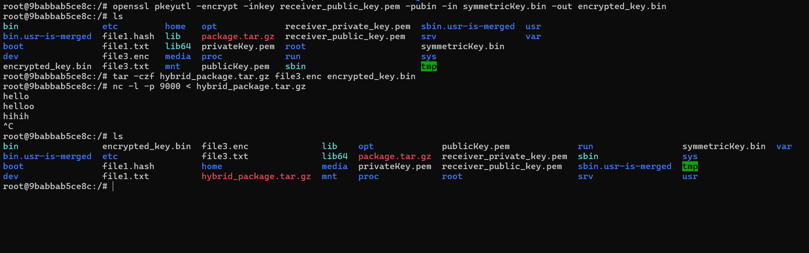
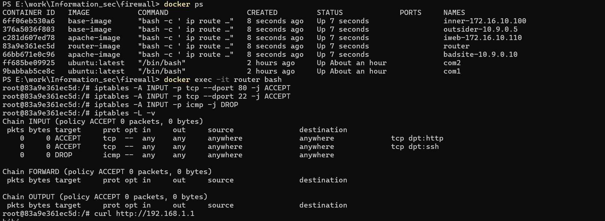

# Lab #1,22110008, Do Duc Anh, INSE330380E_01FIE
# Task 1: Transfer files between computers  
We use docker to create 2 virtual computer to Transfer files between these computers  <br>
**Question 1**:
- Conduct transfering a single plaintext file between 2 computers, 
- Using openssl to implementing measures manually to ensure file integerity and authenticity at sending side, then veryfing at receiving side. 
**Answer 1**:
## 1. Setting up the environment with Docker:
*First, we Set up the environment com1,com2 with Docker:*<br>

```sh
docker run -it --name com1 ubuntu:latest
docker run -it --name com2 ubuntu:latest
```
*Second, we install neccessary tools:
```sh
apt update && apt install -y openssl iptables net-tools
```

## 2.Practice with com1: 
First, we create file in com1
```sh
echo "This is file for Transfer files between computers" > file1.txt

``` 
Second, we generate privateKey.pem; publicKey.pem:
```sh
openssl genrsa -out privateKey.pem 2048
openssl rsa -in privateKey.pem -pubout -out publicKey.pem

``` 
Third, we encrypt file1 of com1 with Sha-2(256):
```sh
openssl dgst -sha256 -sign privateKey.pem -out file1.hash file1.txt

``` 
To see file1.hash and privateKey.pem:
```sh
xxd file1.hash
cat privateKey.pem

``` 
<br>

Fourth, we package the file and hash
```sh
tar -czf package.tar.gz file1.txt file1.hash

``` 
Fifth, we access com2 and check IP of com2:
```sh
hostname -I

``` 
```sh
172.17.0.3 9000

``` 
Fifth, we install netcat:
```sh
apt install -y netcat-openbsd

``` 
Sixth, we Transfer the file to com2 (use nc for simplicity):
```sh
apt install -y netcat
cat package.tar.gz | nc 172.17.0.3 9000

``` 

<br>

## 2.Practice with com2: 
First, we install netcat, transfer file
```sh
apt install -y netcat
apt install -y netcat-openbsd
nc -l -p 9000 > received_package.tar.gz
echo "192.168.1.2 package.tar.gz" | nc 192.168.1.1 9000

``` 
Second, we check file:
```sh
ls -lh received_package.tar.gz


``` 
Second, we unpack file:
```sh
tar -xzf received_package.tar.gz

``` 
Third, we verify integrity and authentication
```sh
openssl dgst -sha256 -verify public_key.pem -signature file1.hash file1.txt


``` 

Output screenshot: 
<br>


# Task 2: Transfering encrypted file and decrypt it with hybrid   
We use docker to Transfering encrypted file and decrypt it with hybrid encryption <br>
**Question 1**:
- Conduct transfering a file (deliberately choosen by you) between 2 computers. 
- The file is symmetrically encrypted/decrypted by exchanging secret key which is encrypted using RSA.
- All steps are made manually with openssl at the terminal of each computer.
**Answer 1**:
## 1.Using com1 and com2 in previous lab 
```sh
docker start com1
docker exec -it com1 /bin/bash

``` 
## 2.Practice with com1: 
First, we create file in com1
```sh
echo "This is a test file for Transfering encrypted file and decrypt it with hybrid encryption" > file3.txt

``` 
Second, we Generate a symmetric key:
```sh
openssl rand -base64 32 > symmetricKey.bin

``` 
Third, Encrypt the file using the symmetric key:(chạy thành công)
```sh
openssl enc -aes-256-cbc -pbkdf2 -salt -in file3.txt -out file3.enc -pass file:symmetricKey.bin


``` 
Fourth, we Encrypt the symmetric key using the receiver's public RSA key: 
```sh
openssl pkeyutl -encrypt -inkey receiver_public_key.pem -pubin -in symmetricKey.bin -out encrypted_key.bin

``` 

Fifth, we Send the encrypted file and key to com2:
```sh
tar -czf hybrid_package.tar.gz file3.enc encrypted_key.bin
nc -l -p 9000 < hybrid_package.tar.gz

``` 
<br>
<br>

## 2.Practice with com2: 
First, we Receive the file
```sh
nc 192.168.1.1 9000 > hybrid_package.tar.gz

``` 
Second, we unpack file:
```sh
tar -xzf hybrid_package.tar.gz

``` 
Third, we Decrypt the symmetric key using your private RSA key:
```sh
openssl rsautl -decrypt -inkey receiver_private_key.pem -in encrypted_key.bin -out symmetricKey_dec.bin

``` 

Second, we Decrypt the file using the symmetric key:
```sh
openssl enc -aes-256-cbc -d -in file3.enc -out file3_dec.txt -pass file:symmetricKey_dec.bin

``` 
Third, we Verify the decrypted file
```sh
cat file3_dec.txt

``` 

Output screenshot: 
<br>
<br>

# Task 3: Firewall configuration 
We use iptable to do this lab on Docker <br>
**Question 1**:
- From VMs of previous tasks, install iptables and configure one of the 2 VMs as a web and ssh server. Demonstrate your ability to block/unblock http, icmp, ssh requests from the other host.computer.
**Answer 1**:
## 1. Setting up the environment with Docker:
*First, we also use com1, com2*<br>
```sh
docker start com1
docker exec -it com1 /bin/bash

``` 

## 2.Practice with com1: 
*First, we install neccessary tools:
```sh
apt install -y apache2
systemctl start apache2
```

*Second, we Enable SSH:
```sh
apt install -y openssh-server
systemctl start ssh


```

*Third, we Configure iptables to allow/block traffic:
-Allow HTTP (port 80) and SSH (port 22)
```sh
iptables -A INPUT -p tcp --dport 80 -j ACCEPT
iptables -A INPUT -p tcp --dport 22 -j ACCEPT

```
-Block ICMP (ping)
```sh
iptables -A INPUT -p icmp -j DROP

```
-View iptables rules
```sh
iptables -L -v

```
<br>

## 2.Practice with com2: 
First, we install curl:
```sh
apt-get install curl

``` 
Second, we Test HTTP connection:
```sh
curl http://192.168.1.1

``` 
Third, we Test SSH connection:
```sh
ssh user@192.168.1.1

``` 
Third, we Test ICMP (ping)
```sh
ping 192.168.1.1

``` 

Fourth, we Unblock ICMP
```sh
iptables -D INPUT -p icmp -j DROP


``` 
Fifth, Re-test:

``` 
Ping again from VM2 to confirm it's now allowed.
``` 

Output screenshot: 
<br>
